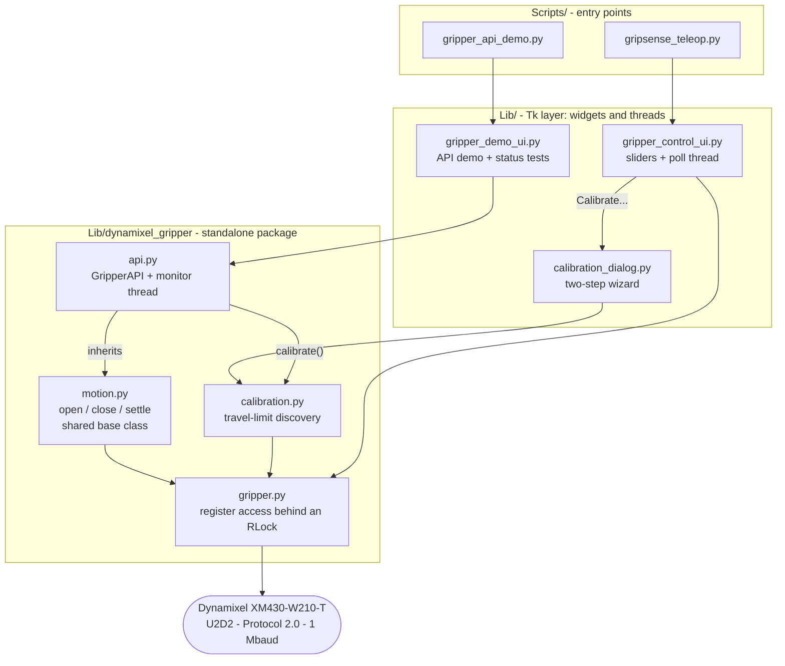
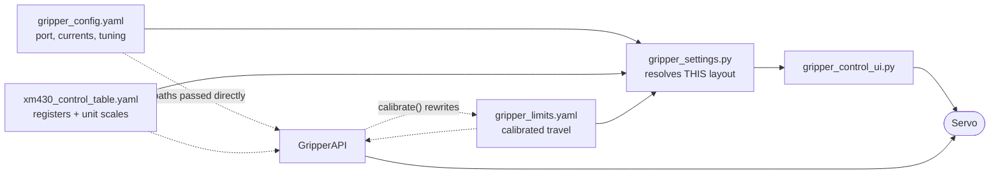
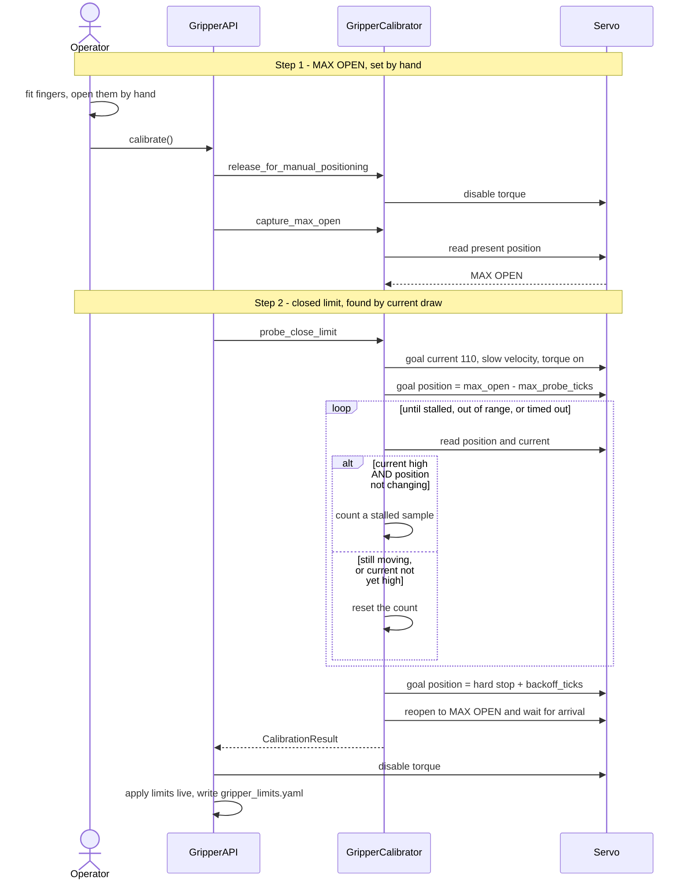
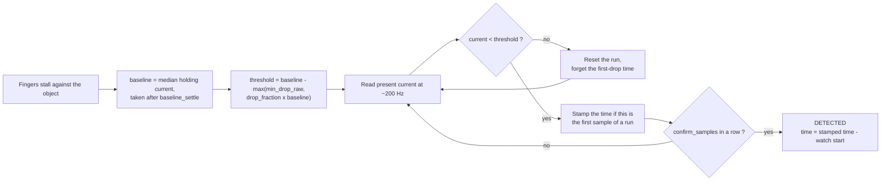
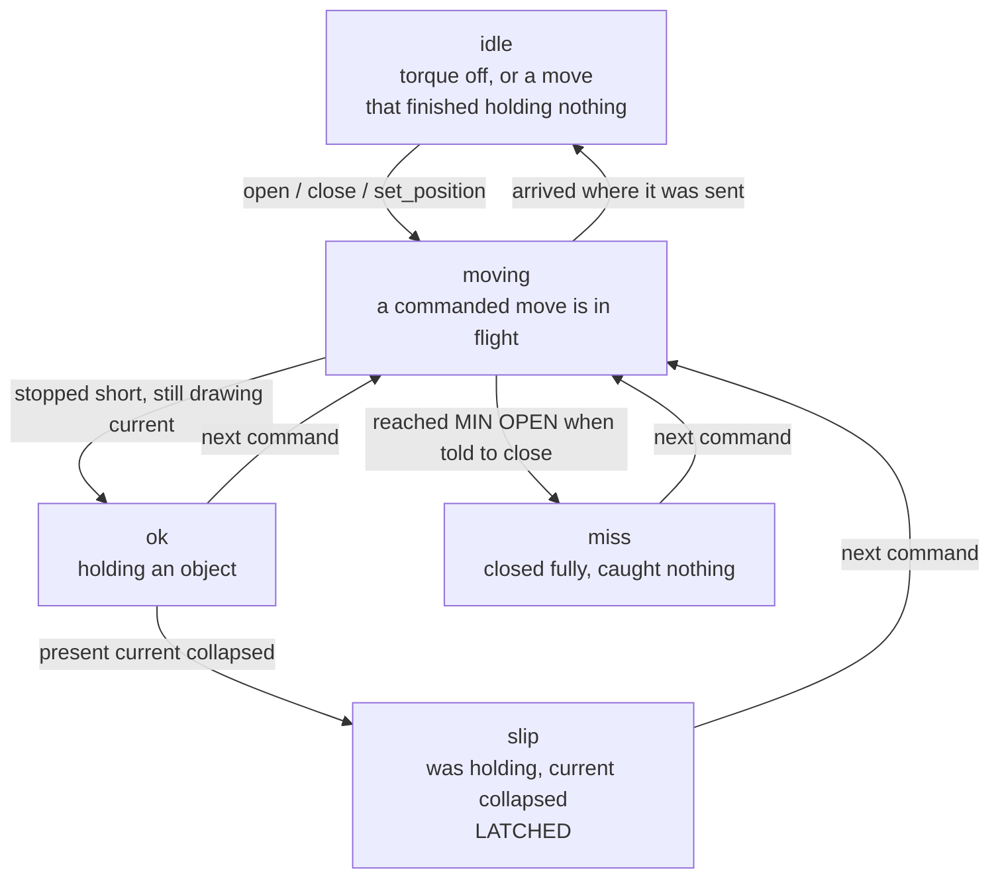

# Slip-Aware Gripper Control

Control software for a slip-aware robotic gripper actuated by a **Dynamixel
XM430-W210-T** servo, built for the PDE4445 module at Middlesex University.

**Author:** Aman Mishra
**Module:** PDE4445 · Middlesex University
**Platform:** Windows 11 · Python 3.13

> The experimental benchmarking rig — grip-force and slip-detection campaigns
> across printed finger materials and paddings, with the statistical report
> built from them — lives on the [`benchmarking`](../../tree/benchmarking)
> branch. This branch is the control software alone.

---

## Description

The gripper runs in **current-based position control** (Operating Mode 5),
where the servo drives toward a commanded position but never exceeds a
commanded current. Because current is proportional to torque, that current
ceiling becomes a grip-force ceiling: the fingers close until they stall
against an object rather than crushing it. This is what makes the gripper
"slip-aware" — grip force is a tunable parameter rather than a consequence of
how far the fingers were told to travel.

It also makes slip observable without any added sensing. While the fingers are
stalled against an object the servo draws close to its current ceiling; when
the object escapes, the fingers are suddenly unopposed and present current
collapses. That collapse is the slip signal.

| Component              | Purpose                                                                                                                                                                          |
| ---------------------- | -------------------------------------------------------------------------------------------------------------------------------------------------------------------------------- |
| **Control API**        | `GripperAPI` — open, close, go to a position, set a grip strength, and read a live `ok` / `slip` / `miss` status. For driving the gripper from your own code.                     |
| **Manual control GUI** | Three sliders (position, goal current, profile velocity) with a live servo readout. Used for setup and ad-hoc testing.                                                            |
| **Calibration**        | Two-step discovery of the fingers' travel limits, run whenever a set of printed fingers is swapped. Available headlessly through the API.                                         |

Plain Python with Tkinter — **no ROS2**, no middleware.

### The control API

```python
from dynamixel_gripper import GripperAPI

with GripperAPI.from_config("gripper_config.yaml",
                            "xm430_control_table.yaml",
                            "gripper_limits.yaml") as api:
    api.enable(True)               # torque on
    api.set_grip_strength(0.6)     # 0.0 weakest, 1.0 firmest — changeable live
    if api.close() == "ok":        # "ok" if it caught something, "miss" if not
        while api.status == "ok":
            do_something_useful()  # becomes "slip" the moment it escapes
```

Positions and grip strengths are normalised 0.0–1.0, so nothing a caller writes
has to change when the fingers are swapped and recalibrated: 0.0 is always as
closed as this pair of fingers goes, 1.0 always as open.

The status is maintained by a background monitor thread, so reading it costs
neither a round trip nor a block. What the five values mean, and why `slip`
latches, is in [The grasp decision](#the-grasp-decision).

`Lib/dynamixel_gripper/` imports nothing from the rest of this repository — no
`gripper_settings`, no Tkinter. The folder can be copied out on its own,
dropped next to your own three YAML files, and used elsewhere:

```bash
grep -rn "gripper_settings\|gripper_control_ui" Lib/dynamixel_gripper/
# returns nothing
```

### Travel-limit calibration

Finger geometry changes every time a set of printed fingers is swapped, so the
open and closed positions are measured on the hardware rather than stored as
fixed tick values:

1. **Max open** — torque is released and the fingers are opened by hand.
   Wherever they are left becomes max open.
2. **Min open** — the gripper drives closed under a fixed current limit until
   present current shows it has met the mechanical stop. That stop is backed
   off by a few ticks so the finger joints' safety snap is not parked against
   its end stop under constant tension.

The result is written to `Config/gripper_limits.yaml`. No position is
hardcoded anywhere once a set of fingers has been calibrated.

---

## Repository layout

```
pickerbot_gripper/
├── Config/
│   ├── gripper_config.yaml         Port, servo ID, and the tuning values for
│   │                               calibration, slip detection and grasp
│   │                               classification
│   └── xm430_control_table.yaml    Register addresses + unit conversion scales
├── Lib/
│   ├── gripper_settings.py         Resolves config paths and calibrated limits;
│   │                               the only module that knows THIS layout
│   ├── gripper_control_ui.py       Tk app for the manual control GUI
│   ├── calibration_dialog.py       Tk wizard over GripperCalibrator: MAX OPEN
│   │                               by hand, then the automatic closing probe
│   ├── gripper_demo_ui.py          Tk app for the API demo — status tests and
│   │                               normalised control, over GripperAPI alone
│   ├── gripper_demo_report.py      The demo's CSV and accuracy matrix
│   └── dynamixel_gripper/          Self-contained servo package: imports nothing
│       │                           from the rest of this repository
│       ├── __init__.py
│       ├── gripper.py              Register reads/writes behind a lock
│       ├── motion.py               Open/close between the calibrated limits,
│       │                           and the settle rule that ends a move
│       ├── calibration.py          Two-step travel-limit discovery (no UI code)
│       ├── status.py               GripStatus, GripperState, SlipEvent
│       ├── config.py               Tuning defaults; limits resolution and the
│       │                           limits-file writer
│       ├── slipwatch.py            The slip rule as arithmetic over current
│       │                           samples — no I/O, so it can be exercised
│       │                           on a list of numbers
│       └── api.py                  GripperAPI: normalised commands, monitor
│                                   thread, ok / slip / miss status
├── Scripts/
│   ├── gripsense_teleop.py         Entry point: manual control and calibration
│   └── gripper_api_demo.py         Entry point: the GripperAPI demo GUI
├── requirements.txt
└── README.md
```

Generated at runtime (not present on a fresh clone):

```
Config/gripper_limits.yaml  Calibrated max/min open, rewritten per calibration
Demo/grip_status_*.csv      One row per staged grip from a demo test run
Demo/grip_status_*.jpg      Expected-vs-reported accuracy matrix for those runs
```

> **Note on directory names:** `Lib/` and `Scripts/` are also the directory
> names used inside a Python virtual environment. The `.gitignore` therefore
> excludes the environment as `.venv/` and never as bare `Lib/` or `Scripts/`,
> which would silently exclude the source code.

---

## Software architecture

The codebase is layered so that **nothing which talks to hardware knows
anything about Tkinter**, and only one module knows where files live. That is
what makes the control logic testable without a servo and the driver reusable
outside this project.

| Layer              | Rule it obeys                                                                                                                                                                     |
| ------------------ | ----------------------------------------------------------------------------------------------------------------------------------------------------------------------------------- |
| Entry points       | Put `Lib/` on `sys.path`, then hand off to the GUI or the API. No logic of their own.                                                                                             |
| Tk layer           | Owns widgets and threads. Only the manual GUI's sliders command the servo directly, and each slider is a single register write.                                                    |
| API layer          | Commands in normalised units, a background monitor thread, and the `ok` / `slip` / `miss` verdict. No UI, and no knowledge of any particular repository layout — paths arrive from the caller. |
| `gripper_settings` | The only module that knows **this** repository's layout. `dynamixel_gripper` is given its paths instead, which is what lets it ship on its own.                                    |
| Driver             | Register reads and writes, serialised behind a lock.                                                                                                                              |

### Control flow: who drives whom



Note where the package boundary falls. Everything inside `dynamixel_gripper`
points inward, so the box is a complete gripper on its own; the GUI is a
consumer of it, not part of it.

### Data flow: configuration in, commands out



The dashed edges are the point: the API is handed paths by its caller rather
than resolving them through `gripper_settings`, which is what lets the package
ship without this repository around it.

### Calibration



Both stall conditions are required. Current alone spikes on the initial
acceleration and would call the stop immediately; position alone cannot tell a
mechanical stop from a servo that has simply arrived.

Because there is no operator prompt inside `calibrate()`, **whatever position
the fingers are at when it is called becomes max open**. Open them by hand
first.

### The slip decision



Two details this diagram exists to make obvious. The threshold combines a
proportional and an absolute margin, so a firm grip must fall proportionally
far while a weak one must still fall a real amount. And the reported time comes
from the **first** dropped sample, not the one that confirmed the run — the
confirmation delay is a property of the detector, not of the gripper, and
should not be charged to the measurement.

One case the diagram leaves out: if the hold current is so low that the
threshold works out at or below zero, no sample can ever fall under it. The API
detects that up front, warns through `on_status`, and exposes the condition as
`slip_detectable`, because otherwise a guaranteed silence would be
indistinguishable from a grip that simply never slipped.

### The grasp decision

Five answers to "what is the gripper doing right now?", maintained by a
background monitor thread so that reading `status` costs neither a round trip
nor a block.



Two of those transitions carry the design.

**`ok` versus `miss`** is decided the moment a move settles, and it is the
current-based-position-control premise applied to a single grasp. Fingers that
reach MIN OPEN after being told to close had nothing between them — a miss.
Fingers that stopped short of where they were sent *while still drawing at
least `grasp.hold_current_fraction` of the goal current* were stopped by
something, and being stopped by something is what a grip is. Fingers that
simply arrived where they were sent are neither, which is `idle`. Both "did it
get there" comparisons allow `grasp.miss_tolerance_ticks` of slack, so that
value is effectively the thinnest object the gripper can tell apart from thin
air.

**`slip` latches** until the next command, and that is not a detail. When an
object escapes, the fingers are unopposed and carry straight on to MIN OPEN —
so a status that kept re-classifying would read `slip` for a few hundred
milliseconds and then settle on `miss`. A caller polling at 10 Hz could watch
an object slip away and never see it happen. Latching means the verdict waits
to be read; `open()`, `close()`, `set_position()` and `enable()` all clear it,
and `last_slip` keeps the timings.

The slip rule lives in `slipwatch.py` as arithmetic over a stream of samples,
with no I/O of its own: the caller reads the servo and hands the numbers over.
That is what lets the detector be exercised on a list of currents rather than
only against hardware — including the too-weak-to-detect case, which is
otherwise awkward to stage.

```python
from dynamixel_gripper import SlipWatch

w = SlipWatch(drop_fraction=0.35, min_drop_raw=15, confirm_samples=3)
w.arm([110, 111, 109, 110, 110])   # -> threshold 71.5
w.feed(110)                        # None: still holding
w.feed(5); w.feed(5)               # None: not confirmed yet
w.feed(5)                          # -> SlipEvent
```

The monitor samples current only while a grip is held, and drops back to
`grasp.idle_poll_interval` otherwise. During a blocking move it stands down
entirely rather than competing with the move for the bus.

Thresholds live in `grasp:` and `slip:` in `Config/gripper_config.yaml`, and
every one has a default in `config.py`, so a config file with neither block
still drives the API.

---

## Hardware requirements

- Dynamixel **XM430-W210-T** servo
- U2D2 (or equivalent) USB-to-TTL interface
- 12 V power supply for the servo
- A pair of gripper fingers, 3D-printed or otherwise

Default communication settings — change in `Config/gripper_config.yaml`:

| Setting   | Value     |
| --------- | --------- |
| Protocol  | 2.0       |
| Port      | `COM5`    |
| Baud rate | 1,000,000 |
| Servo ID  | 1         |

---

## Setup instructions

**1. Clone the repository**

```powershell
git clone <repository-url>
cd pickerbot_gripper
```

**2. Create and activate a virtual environment**

```powershell
python -m venv .venv
.venv\Scripts\Activate.ps1
```

**3. Install dependencies**

```powershell
pip install -r requirements.txt
```

Tkinter ships with the standard library and needs no installation.

**4. Confirm your COM port**

Find the U2D2's port in Device Manager (Ports → USB Serial Port) and update
`Config/gripper_config.yaml` if it is not `COM5`:

```yaml
port:
  device: COM5
  baudrate: 1000000
  protocol_version: 2.0
  dxl_id: 1
```

**5. Calibrate the fingers**

Nothing can be driven safely until the travel limits are known.

```powershell
python Scripts\gripsense_teleop.py
```

Press **Calibrate...**, open the fingers by hand to where the open limit should
be, and confirm; the closing probe finds the other end on its own. The limits
are saved to `Config/gripper_limits.yaml` and the sliders pick them up without
a restart.

**6. Verify the installation**

```powershell
python Scripts\gripper_api_demo.py
```

Press **Connect**, then **Enable torque**, then run a `miss` test with the
fingers clear: the gripper should close on nothing and report `miss`.

---

## Usage examples

### Scripted control with the API

```python
import sys
from pathlib import Path

sys.path.insert(0, str(Path("Lib")))
from dynamixel_gripper import GripperAPI

with GripperAPI.from_config("Config/gripper_config.yaml",
                            "Config/xm430_control_table.yaml",
                            "Config/gripper_limits.yaml") as api:
    api.enable(True)
    api.set_grip_strength(0.5)

    api.open()
    verdict = api.close()

    if verdict == "ok":
        print(f"Holding at {api.baseline_current_raw:.0f} raw")

        api.set_grip_strength(0.9)      # tighten while holding

        if api.wait_for_slip(timeout=25.0) == "slip":
            event = api.last_slip
            print(f"Lost it after {event.detection_time_s:.3f} s")

    api.open()
    api.enable(False)
```

### Calibrating from your own script

```python
with GripperAPI.from_config(config, control_table, limits) as api:
    # Fingers must already be open by hand — whatever position they are
    # at right now becomes MAX OPEN.
    result = api.calibrate()
    print(f"{result.max_open} .. {result.min_open}, "
          f"{result.travel_ticks} ticks of travel")
    # Limits are applied to `api` immediately and written to `limits`.
```

Or have construction do it, only if the limits file is missing or unusable:

```python
api = GripperAPI.from_config(config, control_table, limits,
                             calibrate_if_missing=True)
```

### Manual control GUI

```powershell
python Scripts\gripsense_teleop.py
```

Three sliders and a live readout. If the fingers have not been calibrated, the
position slider's ends are flagged in red — they are the nominal travel from
`gripper_config.yaml`, not this set of fingers.

### Driving the registers directly

If you want the driver without the API:

```python
from dynamixel_gripper import DynamixelGripper

gripper = DynamixelGripper("COM5", 1000000, 2.0, 1,
                           "Config/xm430_control_table.yaml")
gripper.set_operating_mode_current_based_position()
gripper.set_goal_current(110)
gripper.enable_torque()
gripper.set_goal_position(500)
print(gripper.read_present_position(), gripper.read_present_current())
gripper.disable_torque()
gripper.close()          # closes the PORT, not the fingers
```

---

## Definitions

| Term                               | Meaning                                                                                                                                                                       |
| ---------------------------------- | ------------------------------------------------------------------------------------------------------------------------------------------------------------------------------- |
| **Tick**                           | The servo's raw position unit. 1 tick = 0.087891°, so a full 360° turn is 4096 ticks.                                                                                         |
| **Raw current unit**               | The servo's current unit. 1 unit ≈ 2.69 mA, so the configured 100–120 range is ≈ 269–323 mA.                                                                                  |
| **Goal Position**                  | Where the servo is told to move (register 116).                                                                                                                               |
| **Present Position**               | Where the servo actually is (register 132).                                                                                                                                   |
| **Goal Current**                   | The current ceiling the servo will not exceed while moving (register 102). In current-based position control this is the grip-force limit.                                    |
| **Profile Velocity**               | How fast the servo travels toward its goal (register 112). 1 unit ≈ 0.229 rev/min.                                                                                            |
| **Current-based position control** | Operating Mode 5: position control with a hard current ceiling. The fingers stall against an object instead of stripping the gearbox.                                          |
| **Torque enable**                  | Register 64. With torque off the servo is back-drivable and ignores position commands.                                                                                        |
| **Max open**                       | The fully open finger position, set by hand during calibration.                                                                                                               |
| **Min open**                       | The working closed limit: the mechanical stop found during calibration, backed off by `backoff_ticks`.                                                                        |
| **Calibration**                    | The two-step procedure that establishes max open and min open on the hardware. Run whenever fingers are loaded or unloaded; no position is hardcoded.                          |
| **Hard stop**                      | Where the fingers physically stop closing, detected as present current staying high while the position stops changing.                                                         |
| **Back-off**                       | The few ticks reopened from the hard stop to form min open, so the finger joints' safety snap is not held against its end stop under constant tension.                         |
| **Slip**                           | Loss of a gripped object, seen as a sharp fall in present current once the fingers are no longer opposed by the object.                                                        |
| **Hold current**                   | The baseline present current the servo draws while stalled against a gripped object. Measured as the median of `baseline_samples` before the watch begins.                     |
| **Detection time**                 | Seconds from the start of the watch to the **first** sample of the current drop — not to the sample that confirmed it, so the confirmation delay does not inflate it.          |
| **Normalised position**            | The API's position unit: 0.0 is min open, 1.0 is max open, for the fingers currently calibrated. Lets a script survive a finger swap without being edited.                     |
| **Grip strength**                  | The API's normalised grip force: 0.0 is `current.min`, 1.0 is `current.max` from `gripper_config.yaml`. Writes Goal Current, so it can be changed while an object is held.     |
| **Status**                         | The API's verdict on what the gripper is doing: `idle`, `moving`, `ok`, `slip` or `miss`. Kept current by a background monitor thread.                                         |
| **Miss**                           | A close that reached min open, meaning nothing was between the fingers to stop them. Distinct from a slip, where there was a grip and it was lost.                             |
| **Latching**                       | Holding the `slip` verdict until the next command, so the full closure that follows a lost object cannot overwrite it with `miss`.                                             |

---

## FAQ

**Why not ROS2?**
Plain Python was a requirement of the brief. The driver has no framework
dependencies, so a ROS2 node could wrap it unchanged.

**Can I use this with a different Dynamixel model?**
Probably. Copy `Config/xm430_control_table.yaml`, correct the addresses and
unit scales for your model, and pass the new file to
`GripperAPI.from_config()`. The driver reads addresses and unit scales from
that file rather than hardcoding them; register *widths* are still chosen per
method in `gripper.py`, so a model that stores a register at a different length
would need that one method adjusted.

**Why does `close()` mean two different things?**
`GripperAPI.close()` closes the **fingers**. `DynamixelGripper.close()` closes
the **serial port**. Tear an API down with `disconnect()`, or use it as a
context manager, which does it for you.

**Do I have to recalibrate every session?**
No — `Config/gripper_limits.yaml` persists. Recalibrate when you change the
fingers, or when the position slider's ends stop matching reality.

**What happens if I never calibrate?**
`from_config()` falls back to the nominal travel in `gripper_config.yaml` and
sets `.calibrated` to `False`. Those numbers belong to whichever fingers were
fitted when they were written, so check the flag rather than driving blind.
Passing `calibrate_if_missing=True` calibrates instead of falling back.

**Why is my slip never detected?**
Check `api.slip_detectable`. If the hold current is low enough that
`baseline - max(min_drop_raw, drop_fraction × baseline)` is at or below zero,
no sample can fall below the threshold. Grip something firmer, raise
`set_grip_strength()`, or lower `slip.min_drop_raw`.

**Why do some older committed position values read as 4294967155?**
Present Position is signed, but the driver originally returned the raw unsigned
32-bit read-back, so fingers closing past tick 0 reported as just under 2³².
Fixed by `to_signed32`; `config.resolve_limits` also repairs wrapped values
read from a limits file written before the fix.

**Pylance reports "import could not be resolved".**
The scripts add `Lib/` to `sys.path` at runtime, which a static analyser never
executes. `.vscode/settings.json` tells Pylance where to look — reload the
window (`Ctrl+Shift+P` → Developer: Reload Window) after cloning.

---

## Acknowledgements

Built for PDE4445 at Middlesex University. The servo is a Dynamixel
XM430-W210-T driven over Protocol 2.0 through the
[Dynamixel SDK](https://github.com/ROBOTIS-GIT/DynamixelSDK).
