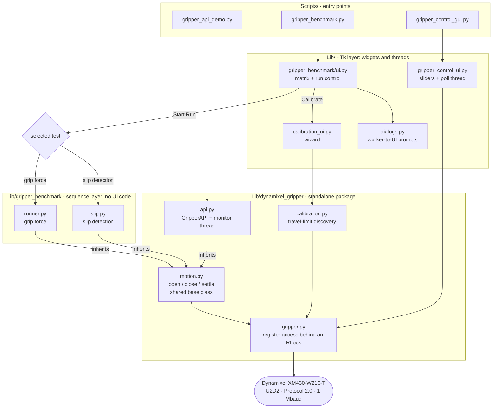
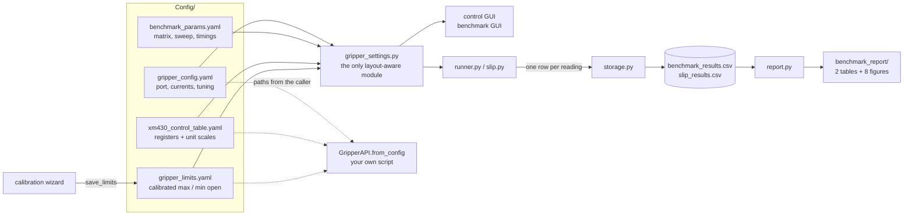
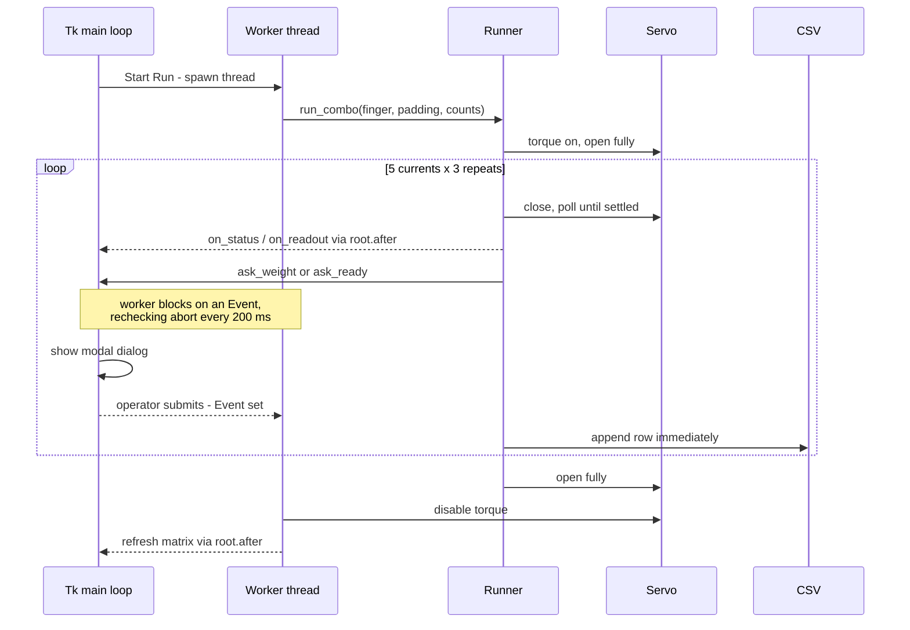
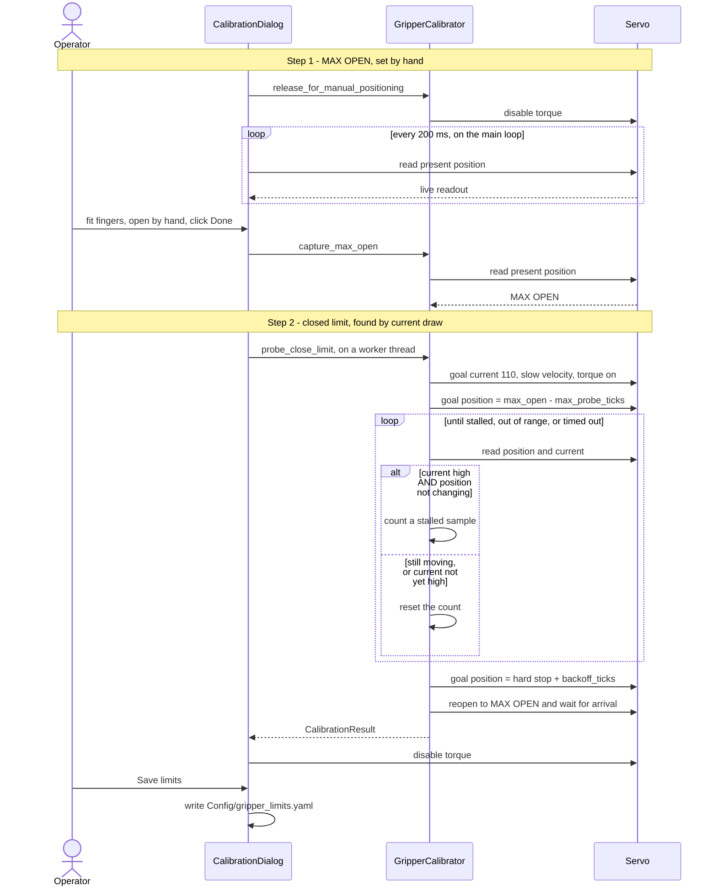
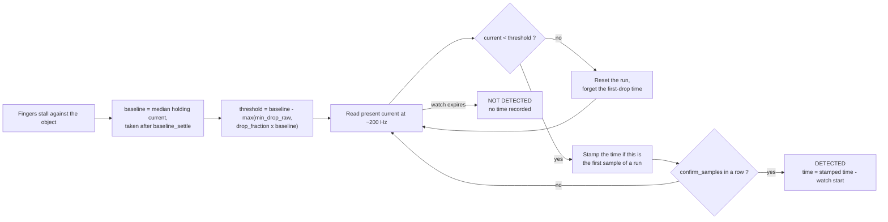
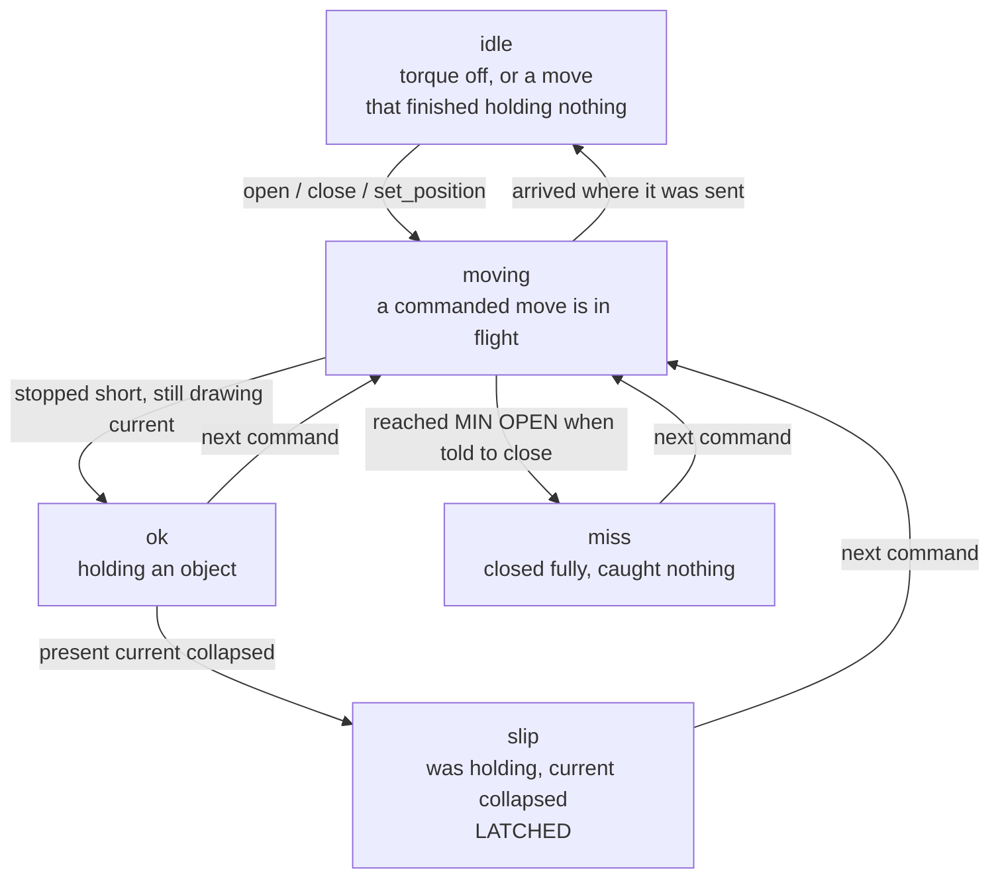

# Slip-Aware Gripper Control, Grip Quality & Slip Detection Benchmark

Control software and an experimental benchmarking rig for a slip-aware robotic
gripper actuated by a **Dynamixel XM430-W210-T** servo, built for the PDE4445
module at Middlesex University.

**Author:** Aman Mishra
**Module:** PDE4445 · Middlesex University
**Platform:** Windows 11 · Python 3.13

---

## Description

The gripper runs in **current-based position control** (Operating Mode 5),
where the servo drives toward a commanded position but never exceeds a
commanded current. Because current is proportional to torque, that current
ceiling becomes a grip-force ceiling: the fingers close until they stall
against an object rather than crushing it. This is what makes the gripper
"slip-aware" — grip force is a tunable parameter rather than a consequence of
how far the fingers were told to travel.

The repository contains two applications, a control API, and the shared
libraries behind them:

| Component              | Purpose                                                                                                                                                        |
| ---------------------- | ---------------------------------------------------------------------------------------------------------------------------------------------------------------- |
| **Manual control GUI** | Three sliders (position, goal current, profile velocity) with a live servo readout. Used for setup and ad-hoc testing.                                          |
| **Benchmark GUI**      | Travel-limit calibration, plus two guided experiments — grip force and slip detection — over the same test matrix, and the statistical report generated from them. |
| **Control API**        | `GripperAPI` — open, close, go to a position, set a grip strength, and read a live `ok` / `slip` / `miss` status. For driving the gripper from your own code rather than by hand. |

The GUIs are plain Python with Tkinter — **no ROS2**.

### The experiments

Two tests run over the same matrix, each independently tracked:

| Variable           | Levels                                         |
| ------------------ | ---------------------------------------------- |
| Finger material    | PETG, PLA, ABS, TPU                            |
| Padding            | No padding, Rubber band, Eraser, Sponge        |
| Goal current limit | 100, 105, 110, 115, 120 raw units (269–323 mA) |
| Repeats            | 3 per cell                                     |

**4 × 4 × 5 × 3 = 240 readings per test.**

Those levels are not baked into the code — they are the `matrix:` block of
`Config/benchmark_params.yaml`, and the UI grid, the completion bookkeeping and
the figures all derive from them.

**Grip force** is measured by closing the gripper onto a kitchen scale and
recording the reading.

**Slip detection** measures whether the gripper can tell that it has _lost_ an
object, and how quickly. While the fingers are stalled against a gripped
object the servo holds near its goal current. When the object is pulled free
the fingers are suddenly unopposed and present current collapses. That
collapse is the slip signal, and the time from the start of the watch to the
first sample of the drop is the detection time.

Both the drop threshold and the confirmation rule are configurable — see
`slip:` in `Config/gripper_config.yaml`. The control API reads the same block,
so a slip observed on the rig means the same thing in a script.

### Travel-limit calibration

No open or closed position is hardcoded. Finger geometry changes every time a
set of printed fingers is swapped, so the limits are discovered on the
hardware in two steps:

1. **Max open, by hand.** Torque is released so the fingers can be opened
   manually. Wherever they are left when you confirm becomes max open — this
   is also when fingers are physically loaded or unloaded.
2. **Closed limit, by current draw.** The gripper closes under a fixed current
   limit until present current shows it has met the mechanical stop, then
   backs off a few ticks. The backed-off position becomes min open, keeping
   the finger joints' safety snap off its end stop rather than under constant
   tension.

The result is written to `Config/gripper_limits.yaml` and read back by every
script, so both GUIs inherit the limits of the fingers actually fitted.

### The control API

Everything above is operated by hand. `dynamixel_gripper.GripperAPI` is the same
gripper without the GUI — five commands and a status:

```python
from dynamixel_gripper import GripperAPI

with GripperAPI.from_config("gripper_config.yaml",
                            "xm430_control_table.yaml",
                            "gripper_limits.yaml") as api:
    api.enable(True)               # torque on
    api.set_grip_strength(0.6)     # 0.0 weakest, 1.0 firmest — changeable live
    if api.close() == "ok":        # "ok" if it caught something, "miss" if not
        while api.status == "ok":
            do_something_useful()  # becomes "slip" the moment it escapes
```

Positions and grip strengths are normalised 0.0–1.0, so nothing a caller writes
has to change when the fingers are swapped and recalibrated: 0.0 is always as
closed as this pair of fingers goes, 1.0 always as open.

The status is maintained by a background monitor thread, so reading it costs
neither a round trip nor a block. What the five values mean, and why `slip`
latches, is in [The grasp decision](#the-grasp-decision).

`Lib/dynamixel_gripper/` imports nothing from the rest of this repository — no
`gripper_settings`, no benchmark, no Tkinter. The folder can be copied out on
its own, dropped next to your own three YAML files, and used elsewhere.

---

## Repository layout

```
pickerbot_gripper/
├── Config/
│   ├── gripper_config.yaml         Port, servo ID, and the tuning values for
│   │                               calibration, slip detection and grasp
│   │                               classification
│   ├── benchmark_params.yaml       The experiment design: test matrix, current
│   │                               sweep, repeats and sequence timings
│   └── xm430_control_table.yaml    Register addresses + unit conversion scales
├── Lib/
│   ├── gripper_settings.py         Resolves config paths and calibrated limits;
│   │                               the only module that knows THIS layout
│   ├── gripper_control_ui.py       Tk app for the manual control GUI
│   ├── dynamixel_gripper/          Self-contained servo package: imports nothing
│   │   │                           from the rest of this repository
│   │   ├── __init__.py
│   │   ├── gripper.py              Register reads/writes behind a lock
│   │   ├── motion.py               Open/close between the calibrated limits,
│   │   │                           and the settle rule that ends a move
│   │   ├── calibration.py          Two-step travel-limit discovery (no UI code)
│   │   ├── status.py               GripStatus, GripperState, SlipEvent
│   │   ├── config.py               Tuning defaults; limits and unit resolution
│   │   ├── slipwatch.py            The slip rule as arithmetic over current
│   │   │                           samples — no I/O, so it can be exercised
│   │   │                           on a list of numbers
│   │   └── api.py                  GripperAPI: normalised commands, monitor
│   │                               thread, ok / slip / miss status
│   └── gripper_benchmark/
│       ├── __init__.py
│       ├── matrix.py               Test grid (from benchmark_params.yaml)
│       │                           + "what counts as complete"
│       ├── storage.py              Results CSV read/append
│       ├── motion.py               Re-export of dynamixel_gripper.motion
│       ├── runner.py               Grip-force sequence (no UI code)
│       ├── slip.py                 Slip-detection sequence (no UI code)
│       ├── dialogs.py              Modal prompts raised from a worker thread
│       ├── calibration_ui.py       Tk calibration wizard
│       ├── ui.py                   Tk configuration panel and run controls
│       └── report.py               Statistics tables and figures
├── Scripts/
│   ├── gripper_control_gui.py      Entry point: manual control
│   ├── gripper_benchmark.py        Entry point: benchmark + report
│   └── gripper_api_demo.py         Entry point: scripted control via GripperAPI
├── requirements.txt
└── README.md
```

The settle rule lives in `dynamixel_gripper/motion.py` rather than beside the
runners that first needed it, because the API needs the same rule and the
package has to stand alone. `gripper_benchmark/motion.py` re-exports it, so
`from gripper_benchmark import MotionBase` still returns the same class object.

Generated at runtime (not present on a fresh clone):

```
Config/gripper_limits.yaml  Calibrated max/min open, rewritten per calibration
benchmark_results.csv       Grip-force readings, appended as captured
slip_results.csv            Slip-detection readings, appended as captured
benchmark_report/           Two statistics tables + eight figures
```

> **Note on directory names:** `Lib/` and `Scripts/` are also the directory
> names used inside a Python virtual environment. The `.gitignore` therefore
> excludes the environment as `.venv/` and never as bare `Lib/` or `Scripts/`,
> which would silently exclude the source code.

---

## Software architecture

The codebase is layered so that **nothing which talks to hardware knows
anything about Tkinter**, and only one module knows where files live. That is
what makes the measurement sequences testable without a servo and the driver
reusable outside this project.

| Layer              | Rule it obeys                                                                                                                     |
| ------------------ | ----------------------------------------------------------------------------------------------------------------------------------- |
| Entry points       | Put `Lib/` on `sys.path`, then hand off to a GUI, the report builder, or the API. No logic of their own.                           |
| Tk layer           | Owns widgets and threads. Any multi-step procedure is delegated to the sequence layer; only the manual GUI's sliders command the servo directly, and each slider is a single register write. |
| Sequence layer     | Drives the servo through a procedure. No `import tkinter` — progress and operator input travel by callback.                        |
| API layer          | Commands in normalised units, a background monitor thread, and the `ok` / `slip` / `miss` verdict. No UI, and no knowledge of any particular repository layout — paths arrive from the caller. |
| Data layer         | Test grid, CSV, statistics. Touches neither hardware nor UI, so its rules can be tested on their own.                              |
| `gripper_settings` | The only module that knows **this** repository's layout. `dynamixel_gripper` is given its paths instead, which is what lets it ship on its own. |
| Driver             | Register reads and writes, serialised behind a lock.                                                                              |

### Control flow: who drives whom



The shape is the point: the Tk layer never reaches past the sequence layer, and
everything funnels through one lock-guarded driver before it reaches the servo.
`runner.py`, `slip.py` and `api.py` are interchangeable from a caller's point of
view because all three inherit the same `MotionBase` — adding a fourth test
means adding a sibling there, not touching the UI's run machinery.

Note where the package boundary falls. Everything inside `dynamixel_gripper`
points inward, so the box on the right is a complete gripper on its own; the
benchmark and the GUIs are consumers of it, not part of it.

### Data flow: configuration in, results out



`gripper_settings` is the only place a path is resolved *for this repository*,
so `dynamixel_gripper` stays reusable in another project and the sequence
modules can be handed a fake servo in a test. The dashed edges are the same
three files reaching the API directly: it is handed paths (or already-loaded
dicts) rather than looking anything up, which is precisely why it does not need
`gripper_settings` and therefore does not need this repository.

Note the loop on the left: calibration writes the limits that every later
session reads back, which is what replaced the hardcoded travel constants.

### What runs on which thread

Serial round trips take milliseconds and the operator prompts block for as long
as a human takes, so every run happens on a worker thread. Tk widgets may only
be touched from the main loop, which is what the `root.after` hops below are
for — and why prompting for a weight needs an explicit handshake rather than a
function call.



Because the row is written the moment it is captured, an abort at any point
loses nothing already measured — which is what makes resuming a combination
possible rather than restarting it.

### Calibration



Both stall conditions are required. Current alone spikes on the initial
acceleration and would call the stop immediately; position alone cannot tell a
mechanical stop from a servo that has simply arrived.

### The slip decision



Two details this diagram exists to make obvious. The threshold combines a
proportional and an absolute margin, so a firm grip must fall proportionally
far while a weak one must still fall a real amount. And the reported time comes
from the **first** dropped sample, not the one that confirmed the run — the
confirmation delay is a property of the detector, not of the gripper, and
should not be charged to the measurement.

One case the diagram leaves out: if the hold current is so low that the
threshold works out at or below zero, no sample can ever fall under it. The
runner detects that up front and warns, because otherwise a guaranteed timeout
would be indistinguishable from a genuine failure to slip. The API exposes the
same condition as `slip_detectable`.

### The grasp decision

The benchmark asks a question once per repeat: did it slip, and how fast? The
API has to answer a different one continuously — what is the gripper doing right
now? Five answers, maintained by a background monitor thread so that reading
`status` costs neither a round trip nor a block.



Two of those transitions carry the design.

**`ok` versus `miss`** is decided the moment a move settles, and it is the
current-based-position-control premise applied to a single grasp instead of a
benchmark sweep. Fingers that reach MIN OPEN after being told to close had
nothing between them — a miss. Fingers that stopped short of where they were
sent *while still drawing at least `grasp.hold_current_fraction` of the goal
current* were stopped by something, and being stopped by something is what a
grip is. Fingers that simply arrived where they were sent are neither, which is
`idle`. Both "did it get there" comparisons allow
`grasp.miss_tolerance_ticks` of slack, so that value is effectively the
thinnest object the gripper can tell apart from thin air.

**`slip` latches** until the next command, and that is not a detail. When an
object escapes, the fingers are unopposed and carry straight on to MIN OPEN — so
a status that kept re-classifying would read `slip` for a few hundred
milliseconds and then settle on `miss`. A caller polling at 10 Hz could watch an
object slip away and never see it happen. Latching means the verdict waits to be
read; `open()`, `close()`, `set_position()` and `enable()` all clear it, and
`last_slip` keeps the timings.

The slip rule itself is the one above, unchanged — same baseline, same threshold,
same confirmation count, read from the same `slip:` block. It lives in
`slipwatch.py` as arithmetic over a stream of samples, with no I/O of its own:
the caller reads the servo and hands the numbers over. That is what lets the
detector be exercised on a list of currents rather than only against hardware —
including the too-weak-to-detect case, which is otherwise awkward to stage.

```python
from dynamixel_gripper import SlipWatch

w = SlipWatch(drop_fraction=0.35, min_drop_raw=15, confirm_samples=3)
w.arm([110, 111, 109, 110, 110])   # -> threshold 71.5
w.feed(110)                        # None: still holding
w.feed(5); w.feed(5)               # None: not confirmed yet
w.feed(5)                          # -> SlipEvent
```

The monitor samples
current only while a grip is held, for the reason given above, and drops back to
`grasp.idle_poll_interval` otherwise. During a blocking move it stands down
entirely rather than competing with the move for the bus.

Thresholds live in `grasp:` in `Config/gripper_config.yaml`, and every one has a
default in `api.py`, so a config file with no `grasp:` block still drives the
API.

---

## Hardware requirements

- Dynamixel **XM430-W210-T** servo
- U2D2 (or equivalent) USB-to-TTL interface
- 12 V power supply for the servo
- Kitchen scale (grams) for the grip-force test
- A test object that can be pulled free by hand, for the slip test
- 3D-printed fingers in PETG, PLA, ABS and TPU
- Padding samples: rubber band, eraser, sponge

Default communication settings — change in `Config/gripper_config.yaml`:

| Setting   | Value     |
| --------- | --------- |
| Protocol  | 2.0       |
| Port      | `COM5`    |
| Baud rate | 1,000,000 |
| Servo ID  | 1         |

---

## Setup instructions

**1. Clone the repository**

```powershell
git clone <repository-url>
cd pickerbot_gripper
```

**2. Create and activate a virtual environment**

```powershell
python -m venv .venv
.venv\Scripts\Activate.ps1
```

**3. Install dependencies**

```powershell
pip install -r requirements.txt
```

Tkinter ships with the standard library and needs no installation. `pandas`
and `matplotlib` are used only for report generation — the gripper itself
runs without them.

**4. Confirm your COM port**

Find the U2D2's port in Device Manager (Ports → USB Serial Port) and update
`Config/gripper_config.yaml` if it is not `COM5`:

```yaml
port:
  device: COM5
  baudrate: 1000000
  protocol_version: 2.0
  dxl_id: 1
```

**5. Verify the installation**

```powershell
python Scripts\gripper_control_gui.py
```

The window should open and the live readout should show a changing present
position when you move the fingers by hand.

Once the fingers have been calibrated, the API can be checked the same way — it
closes on nothing and should report a miss:

```powershell
python Scripts\gripper_api_demo.py --miss
```

---

## Definitions

| Term                               | Meaning                                                                                                                                                                                                                       |
| ---------------------------------- | ----------------------------------------------------------------------------------------------------------------------------------------------------------------------------------------------------------------------------- |
| **Tick**                           | The servo's raw position unit. 1 tick = 0.087891°, so a full 360° turn is 4096 ticks.                                                                                                                                         |
| **Raw current unit**               | The servo's current unit. 1 unit ≈ 2.69 mA. The benchmark's 100–120 range is therefore ≈ 269–323 mA.                                                                                                                          |
| **Goal Position**                  | Where the servo is told to move (register 116).                                                                                                                                                                               |
| **Present Position**               | Where the servo actually is (register 132).                                                                                                                                                                                   |
| **Goal Current**                   | The current ceiling the servo will not exceed while moving (register 102). In current-based position control this is the grip-force limit.                                                                                    |
| **Profile Velocity**               | How fast the servo travels toward its goal (register 112). 1 unit ≈ 0.229 rev/min. Held constant during benchmarking so force is the only variable.                                                                           |
| **Current-based position control** | Operating Mode 5: position control with a hard current ceiling. The fingers stall against an object instead of stripping the gearbox.                                                                                         |
| **Torque enable**                  | Register 64. With torque off the servo is back-drivable and ignores position commands.                                                                                                                                        |
| **Max open**                       | The fully open finger position, set by hand during calibration.                                                                                                                                                               |
| **Min open**                       | The working closed limit: the mechanical stop found during calibration, backed off by `backoff_ticks`.                                                                                                                        |
| **Calibration**                    | The two-step procedure that establishes max open and min open on the hardware. Run whenever fingers are loaded or unloaded; no position is hardcoded.                                                                        |
| **Hard stop**                      | Where the fingers physically stop closing, detected as present current staying high while the position stops changing.                                                                                                        |
| **Back-off**                       | The few ticks reopened from the hard stop to form min open, so the finger joints' safety snap is not held against its end stop under constant tension.                                                                        |
| **Finger material**                | The filament a finger pair is printed in: PETG, PLA, ABS or TPU.                                                                                                                                                              |
| **Padding**                        | The compliant layer bonded to the finger face: none, rubber band, eraser or sponge.                                                                                                                                           |
| **Combination (combo)**            | One finger material paired with one padding — 16 in total. A run covers one combination across all five currents.                                                                                                             |
| **Repeat**                         | One of the three measurements taken at a given combination and current.                                                                                                                                                       |
| **CV (%)**                         | Coefficient of variation, `SD ÷ mean × 100`. A repeatability measure: lower means the grip is more consistent between repeats.                                                                                                |
| **Slip**                           | Loss of a gripped object, seen as a sharp fall in present current once the fingers are no longer opposed by the object.                                                                                                        |
| **Hold current**                   | The baseline present current the servo draws while stalled against a gripped object. Measured as the median of `baseline_samples` before the watch begins.                                                                    |
| **Detection time**                 | Seconds from the start of the watch to the **first** sample of the current drop — not to the sample that confirmed it, so the confirmation delay does not inflate the measurement.                                            |
| **Detection rate**                 | The share of a cell's repeats in which a slip was seen before the watch timed out.                                                                                                                                            |
| **Normalised position**            | The API's position unit: 0.0 is min open, 1.0 is max open, for the fingers currently calibrated. Lets a script survive a finger swap without being edited.                                                                    |
| **Grip strength**                  | The API's normalised grip force: 0.0 is `current.min`, 1.0 is `current.max` from `gripper_config.yaml`. Writes Goal Current, so it can be changed while an object is held.                                                    |
| **Status**                         | The API's verdict on what the gripper is doing: `idle`, `moving`, `ok`, `slip` or `miss`. Kept current by a background monitor thread.                                                                                        |
| **Miss**                           | A close that reached min open, meaning nothing was between the fingers to stop them. Distinct from a slip, where there was a grip and it was lost.                                                                            |
| **Latching**                       | Holding the `slip` verdict until the next command, so the full closure that follows a lost object cannot overwrite it with `miss`.                                                                                            |

---

## Usage examples

### Manual control GUI

```powershell
python Scripts\gripper_control_gui.py
```

Torque starts **disabled** — nothing moves until you press **Enable Torque**.
The Goal Position register is primed to max open at startup, so the first
torque-enable opens the gripper rather than jumping to a stale target.

Set the current slider _before_ enabling torque when handling anything
fragile. **EMERGENCY STOP** disables torque immediately and makes the fingers
back-drivable.

### Calibrating the travel limits

```powershell
python Scripts\gripper_benchmark.py
```

Press **Calibrate travel limits…** — required before either test, and again
whenever fingers are swapped.

1. **Step 1.** Torque is released. Load or unload fingers now, open them fully
   by hand, and press **Done — this is MAX OPEN**. The live readout shows the
   position you are setting.
2. **Step 2.** Confirm the prompt and keep hands clear. The gripper closes at
   110 raw (~296 mA) until present current shows it has met the stop, backs
   off `backoff_ticks`, and reopens.
3. **Review and save.** The wizard shows max open, the hard stop, min open and
   the resulting travel. **Save limits** writes `Config/gripper_limits.yaml`;
   **Retry** discards the result and starts over.

Nothing is written until you accept it, so a probe that catches on the wrong
obstruction can simply be repeated. If no stop is found within the probe range
or the timeout, calibration fails with an explanation rather than guessing a
limit.

> `backoff_ticks` is a rig-specific value — tune it in
> `Config/gripper_config.yaml` once you can see how much slack the safety snap
> needs.

### Running a test

1. **Choose the test** — grip force or slip detection. Each tracks its own
   completion, so a combination finished for one may still be outstanding for
   the other.
2. **Select a combination** from the 4 × 4 grid. Completed cells read `done`
   and cannot be selected again.
3. **Start Run.** Torque is enabled and the gripper sweeps all five current
   limits, three repeats each.
4. Then, per repeat:
   - **Grip force** — the gripper closes onto the scale; enter the reading in
     the popup and press Submit (or Enter).
   - **Slip detection** — a popup waits for you to seat the object. The
     gripper grips it and measures its hold current, then the status line says
     `PULL THE OBJECT until it slips`. Pull steadily; the drop is timed
     automatically and the run continues on its own.
5. When the combination finishes, torque is disabled automatically. Swap the
   fingers or padding and select the next cell.

Each reading is written to its CSV the moment it is captured. Aborting mid-run
keeps everything already captured, and re-selecting that combination resumes
from the exact repeat where it stopped — no duplicates.

Once every combination of **both** tests is complete, the report is generated
automatically.

### Generating the report manually

```powershell
python Scripts\gripper_benchmark.py --report
```

Writes to `benchmark_report/`. Each test's outputs are produced only if that
test has data, so a partial report is fine.

**Grip force**

| File                                    | Contents                                                       |
| --------------------------------------- | -------------------------------------------------------------- |
| `summary_statistics.csv` / `.png`       | N, mean, SD, min, median, max, range and CV% for all 80 cells  |
| `fig1_weight_vs_current_by_finger.png`  | Force vs current, one panel per material, one line per padding |
| `fig2_weight_vs_current_by_padding.png` | The same data transposed                                       |
| `fig3_mean_grip_force_heatmap.png`      | Mean force across the full matrix                              |
| `fig4_repeatability_cv_heatmap.png`     | CV% — which settings grip most consistently                    |
| `fig5_combination_ranking.png`          | Combinations ranked by mean grip force                         |

**Slip detection**

| File                                     | Contents                                                                     |
| ---------------------------------------- | ------------------------------------------------------------------------------ |
| `slip_summary_statistics.csv` / `.png`   | N, slips seen, detection rate, timing statistics, hold current and drop % per cell |
| `fig6_slip_detection_time_by_finger.png` | Detection time vs current, one panel per material, one line per padding        |
| `fig7_slip_detection_rate_heatmap.png`   | How reliably the drop was seen across the matrix                               |
| `fig8_slip_detection_time_heatmap.png`   | Mean detection time across the matrix                                          |

Timing figures use only the repeats where a slip was actually detected; cells
with none appear as `-` in the table and are left blank in the plots rather
than being counted as zero.

### Results CSV schemas

`benchmark_results.csv` — grip force:

| Column                                      | Description                                |
| ------------------------------------------- | ------------------------------------------ |
| `timestamp`                                 | ISO timestamp of the reading               |
| `finger_material`                           | PETG / PLA / ABS / TPU                     |
| `padding`                                   | No padding / Rubber band / Eraser / Sponge |
| `goal_current_raw`, `goal_current_ma`       | Commanded current limit                    |
| `repeat`                                    | 1–3                                        |
| `weight_g`                                  | Scale reading entered by the operator      |
| `present_position_ticks`                    | Where the fingers stalled                  |
| `present_current_raw`, `present_current_ma` | Actual current drawn at stall              |

`slip_results.csv` — slip detection. Columns after `slip_detected` are blank
when no slip was seen:

| Column                                          | Description                                             |
| ----------------------------------------------- | ------------------------------------------------------- |
| `timestamp`, `finger_material`, `padding`       | As above                                                |
| `goal_current_raw`, `goal_current_ma`, `repeat` | As above                                                |
| `slip_detected`                                 | 1 if the drop was seen before the watch timed out, else 0 |
| `detection_time_s`                              | Seconds to the first sample of the drop                 |
| `baseline_current_raw`, `baseline_current_ma`   | Hold current before the drop                            |
| `slip_current_raw`, `slip_current_ma`           | Current at the first dropped sample                     |
| `drop_raw`, `drop_percent`                      | Size of the fall, absolute and relative to the baseline |
| `position_at_slip_ticks`, `position_shift_ticks`| Where the fingers ended up, and how far they moved      |
| `watch_duration_s`, `samples`                   | Length of the watch and how many current reads it took  |

### Scripted control with the API

```powershell
python Scripts\gripper_api_demo.py           # grip and slip test, needs an object
python Scripts\gripper_api_demo.py --miss    # close on nothing, expect "miss"
```

The demo is a worked example of everything below. For your own code:

```python
from dynamixel_gripper import GripperAPI

api = GripperAPI.from_config("Config/gripper_config.yaml",
                             "Config/xm430_control_table.yaml",
                             "Config/gripper_limits.yaml")
with api:
    if not api.calibrated:
        raise SystemExit("Calibrate the fingers first.")

    api.enable(True)                  # torque on; False releases it again
    api.set_grip_strength(0.5)        # 0.0 = current.min, 1.0 = current.max

    api.open()                        # -> max open
    verdict = api.close()             # -> min open; "ok" or "miss"

    if verdict == "ok":
        api.set_grip_strength(0.9)    # tighten on what is already held
        if api.wait_for_slip(timeout=30) == "slip":
            print(api.last_slip.detection_time_s)

    api.set_position(0.35)            # 0.0 closed .. 1.0 open
    api.enable(False)
```

| Call                          | Does                                                                                          |
| ----------------------------- | --------------------------------------------------------------------------------------------- |
| `enable(on)`                  | Torque on or off. Enabling primes Goal Position where the fingers already are, so nothing jerks. |
| `open()` / `close()`          | Drive to max open / min open. Return the resulting status.                                     |
| `set_position(f)`             | Drive to a normalised position, 0.0 closed to 1.0 open.                                        |
| `set_grip_strength(f)`        | Set the current ceiling, 0.0 to 1.0. Works with torque on and an object held.                  |
| `status`                      | `idle` / `moving` / `ok` / `slip` / `miss`. A plain attribute read.                             |
| `state()`                     | One snapshot: status, position in ticks and normalised, current raw and mA, grip strength.     |
| `wait_for_slip(timeout)`      | Block until the grip stops being `ok`; returns what it became.                                 |
| `disconnect()`                | Stop the monitor, drop torque, release the port. `with` does it for you.                       |

Moves block until the fingers settle, which is why `close()` can return a
verdict. Pass `wait=False` for fire-and-forget and let the monitor resolve the
status instead.

> **One naming trap.** `GripperAPI.close()` closes the **fingers**.
> `DynamixelGripper.close()` closes the **serial port**. Tear the API down with
> `disconnect()`, or use it as a context manager as above.

Optional callbacks: `on_status(text)` for progress and warnings,
`on_readout(position, current)` for live values, and `on_status_change(old, new)`
if you would rather be told than poll — that one fires on the monitor thread, so
do not block in it.

### Driving the registers directly

The API is usually what you want, but the driver underneath it is importable on
its own when you need register-level control:

```python
import sys
from pathlib import Path

sys.path.insert(0, str(Path(__file__).resolve().parent.parent / "Lib"))

import gripper_settings as settings

max_open, min_open, calibrated = settings.travel_limits()
if not calibrated:
    raise SystemExit("Calibrate the fingers first.")

gripper = settings.connect()          # opens the port, sets Operating Mode 5
try:
    gripper.set_goal_current(110)     # ~296 mA grip ceiling
    gripper.set_profile_velocity(settings.VELOCITY_MAX)
    gripper.set_goal_position(min_open)
    gripper.enable_torque()

    print(gripper.read_present_position(), gripper.read_present_current())
finally:
    gripper.close()                   # disables torque, closes the port
```

`DynamixelGripper` serialises every read and write behind a lock, so a polling
thread and a command thread can share one instance safely.

### Calibrating from your own script

`GripperCalibrator` has no UI dependency either — step 1 is just "read the
position whenever the operator says so":

```python
from dynamixel_gripper import GripperCalibrator

calibrator = GripperCalibrator(gripper, on_status=print, **settings.CALIBRATION)
calibrator.release_for_manual_positioning()
input("Open the fingers by hand, then press Enter...")
calibrator.capture_max_open()

result = calibrator.probe_close_limit()   # raises CalibrationError if no stop
settings.save_limits(result)
```

### Running a test sequence headlessly

Neither runner contains UI code — supply callbacks and they will drive the
sequence from anywhere:

```python
from gripper_benchmark import BenchmarkRunner, SlipRunner, append_row, recorded_counts
from gripper_benchmark.matrix import CSV_FIELDS, SLIP_CSV_FIELDS

runner = BenchmarkRunner(
    gripper,
    max_open=max_open,
    min_open=min_open,
    profile_velocity=settings.BENCHMARK_PROFILE_VELOCITY,
    on_status=print,
    on_reading=lambda row: append_row(row, settings.RESULTS_CSV, CSV_FIELDS),
    ask_weight=lambda finger, pad, current, rep: float(input("Scale (g): ")),
)
runner.run_combo("PETG", "Sponge", recorded_counts([], "PETG", "Sponge"))

slip = SlipRunner(
    gripper,
    max_open=max_open,
    min_open=min_open,
    profile_velocity=settings.BENCHMARK_PROFILE_VELOCITY,
    on_status=print,
    on_reading=lambda row: append_row(row, settings.SLIP_CSV, SLIP_CSV_FIELDS),
    ask_ready=lambda finger, pad, current, rep: input("Object in place? "),
    **settings.SLIP,
)
slip.run_combo("PETG", "Sponge", recorded_counts([], "PETG", "Sponge"))
```

Both raise `AbortedError` if the shared `abort_event` is set, and both accept
`counts` so a partially recorded combination continues rather than restarts.

---

## FAQ

**The GUI opens but the gripper does not move.**
Torque starts disabled by design, so an accidental launch cannot slam the
fingers shut. Press **Enable Torque**.

**"Failed to open port COM5".**
The port name is wrong, the U2D2 is unplugged, or another program is holding
the port — including a second copy of this application. Check Device Manager
and update `Config/gripper_config.yaml`.

**"NOT CALIBRATED" is shown and Start Run is greyed out.**
The limits have never been established for the fingers currently fitted. Run
the calibration wizard. The manual control GUI still opens, but says so and
falls back to the nominal values in `gripper_config.yaml`.

**Calibration says it travelled the full probe range without meeting a stop.**
Either the fingers are not mounted, or max open was captured while the gripper
was already closed, so closing further found nothing. Re-open by hand and
retry. Nothing is saved when this happens — the previous limits stay in force.

**The closing probe stops too early.**
It calls the stop when present current stays above
`stall_current_fraction × probe_current` while the position stops changing. A
stiff joint or a high-friction padding can trip that mid-travel. Raise
`probe_current`, or raise `stall_current_fraction` toward 1.0, in
`Config/gripper_config.yaml`.

**A slip is never detected even though the object clearly came out.**
Check `baseline_current_raw` in `slip_results.csv`. If the hold current is
small, the drop that `drop_fraction`/`min_drop_raw` demands cannot happen — the
status line warns about this at the time. It usually means the fingers were not
really loaded against the object. Grip something firmer, raise the goal
current, or lower `min_drop_raw`.

**Slips are detected the instant the watch starts.**
The baseline was measured before the grip had settled. Increase
`baseline_settle`, or `baseline_samples`, in the `slip:` block.

**What is the difference between `miss` and `slip`?**
`miss` means the fingers closed all the way with nothing between them — there
was never a grip. `slip` means there *was* a grip and it was lost. They are easy
to confuse precisely because a slip is followed by a full closure a moment
later, which is why `slip` latches until the next command rather than being
overwritten by the `miss` that physically follows it.

**Can I use the API without the rest of this repository?**
Yes — that is what it is for. Copy `Lib/dynamixel_gripper/` and call
`GripperAPI.from_config()` with paths to your own config, control table and
limits files. Nothing in that folder imports `gripper_settings`,
`gripper_benchmark` or Tkinter. Without a limits file it falls back to the
nominal travel in the config; check `.calibrated` to find out which you got.

**`status` is stuck on `moving`.**
Only reachable after a `wait=False` command. The monitor decides a non-blocking
move has finished with the same settle rule a blocking one uses, but sampling at
`grasp.idle_poll_interval` rather than every 100 ms, so it resolves a fraction
of a second later than a blocking call would. If it never resolves, the fingers
are still creeping — check that `profile_velocity` is not near zero.

**`close()` returns `miss` even though there was an object in the fingers.**
The object was thin enough that the fingers ended within
`grasp.miss_tolerance_ticks` of min open, so a real grip looks like a full
closure. Lower that value in the `grasp:` block until it is smaller than the
thinnest object you intend to pick.

**Why do some committed position values look like `4294967155`?**
Present Position is signed, and the driver used to return the raw unsigned
read-back, so fingers closing past tick 0 reported as just under 2³².
`to_signed32` now corrects this at the driver, alongside the `to_signed16` that
was already there for current. Two consequences worth knowing: the rows already
in `benchmark_results.csv` and `slip_results.csv` still carry wrapped positions —
no figure or statistic reads position, so the report is unaffected — and
`Config/gripper_limits.yaml` keeps a wrapped `min_open` until the next
calibration rewrites it. The API repairs wrapped limits as it loads them, so it
is correct immediately; the GUIs show them as stored until you recalibrate.

**Can I resume an aborted run?**
Yes. Readings are written to the CSV as they are captured. Re-select the
combination, confirm the resume prompt, and it continues from the repeat where
it stopped without duplicating rows.

**Can I change the materials, paddings or current levels?**
Edit the `matrix:` block in `Config/benchmark_params.yaml` — no code change
needed. Everything else — the UI grid, the completion logic, the figures —
derives from those lists.

Be aware this invalidates collected data. The completion bookkeeping counts
recorded rows per finger / padding / current, so renaming or removing a level
orphans its existing rows in the CSV (they are ignored, not deleted), and
adding one marks previously complete combinations incomplete again.

**Can I use a different Dynamixel servo?**
Copy `Config/xm430_control_table.yaml`, edit the register addresses and unit
scales for your model, and point `CONTROL_TABLE_PATH` in
`Lib/gripper_settings.py` at the copy — or, from the API, just pass the new path
to `GripperAPI.from_config()`. The driver reads addresses and unit scales from
that file, so no code changes are needed for another X-series model. Register
*widths* are still chosen per method in `gripper.py`, so a model that stores a
register at a different length would need that one method adjusted.

**Pylance reports "import could not be resolved".**
The scripts add `Lib/` to `sys.path` at runtime, which a static analyser never
executes. `.vscode/settings.json` tells Pylance where to look — reload the
window (`Ctrl+Shift+P` → Developer: Reload Window) after cloning.

**Why a kitchen scale rather than a load cell?**
It measures the quantity of interest — the force the fingers apply — with
equipment available for the module, at a resolution well below the differences
between materials. The operator-entered reading is the reason each close pauses
for a popup.

**Why not ROS2?**
Plain Python was a requirement of the brief. The driver has no framework
dependencies, so a ROS2 node could wrap it unchanged.

**Why is `benchmark_results.csv` committed rather than ignored?**
It and `slip_results.csv` hold 480 measurements that cannot be regenerated
without repeating the entire experiment. The report is derived from them and is
cheap to rebuild, but the raw data is not.

**Why is `Config/gripper_limits.yaml` committed if it is generated?**
It records which fingers the committed results were taken with. It is rewritten
by every calibration, so treat a change to it as part of a finger swap rather
than as noise.

**How fast is slip sampling, and does that bound the detection time?**
Yes. The watch loop reads only present current — position costs a second round
trip and would halve the rate — giving roughly 200 Hz at 1 Mbaud with the
default `poll_interval` of 5 ms. Detection times are therefore meaningful to
about ±5 ms, plus however long the object takes to actually let go.

---

## Acknowledgements

- **ROBOTIS** for the [Dynamixel SDK](https://github.com/ROBOTIS-GIT/DynamixelSDK)
  and the XM430-W210-T control table documentation.
- **Middlesex University**, module **PDE4445**, for the project brief and
  laboratory hardware.
- The [pandas](https://pandas.pydata.org/),
  [Matplotlib](https://matplotlib.org/) and [PyYAML](https://pyyaml.org/)
  projects, which the analysis and configuration layers are built on.

---

Copyright © 2026 `Aman Mishra`. All rights reserved.
